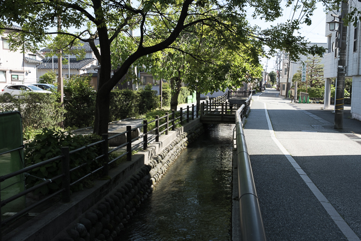

UhdrGen
========

Convert SDR + HDR images to Jpeg with gainmap.

Description
-----------
This project provides a Python tool to generate single HDR jpg with Gain map,
from SDR/HDR pair.

<table>
  <tr>
    <th><b>SDR image</b></br>input_sdr.jpg</th>
    <th><b>HDR image</b></br>input_hdr.avif</th>
    <th><b>HDR image with gain map</b></br>output_uhdr.jpg</th>
  </tr>
  <tr>
    <td></td>
    <td></td>
    <td></td>
  </tr>
</table>
Note: HDR display and compatible browser (ex: Chrome) to see hdr images.
</br></br>
Lightroom does not provide precise control over the processing of both SDR and HDR images when using a gain map.
By combining an SDR image with an HDR image to create an Ultra HDR image with a gain map, you achieve an optimal balance across all types of displays, with fine-grained control over how each version is rendered.
In addition, the resulting HDR images are fully compatible with Instagram posts—something that is not always guaranteed with Lightroom exports.

Install and launch
------------------
```
   git clone https://github.com/jb-jrdn/UhdrGen.git
   cd UhdrGen
   python3 -m venv venv               # create venv
   source venv/bin/activate           # macOS / Linux
   venv\Scripts\activate              # Windows PowerShell
   pip install -r requirements.txt    # install dependencies
   brew install libultrahdr           # install ultrahdr lib, for mac
```
For Windows: Install or build app from https://github.com/google/libultrahdr, and add 'ultrahdr_app' to the PATH

Usage
-----
Single file mode:
```
   python main.py --sdr path/to/image_sdr.jpg --hdr path/to/image_hdr.avif --output path/to/output.jpg
```

Batch mode (entire folder):
- SDR and HDR images must share the same base name with suffixes `_sdr` / `_hdr`:
    - image1_sdr.jpg / image1_hdr.avif
    - image2_sdr.jpg / image2_hdr.avif
```
   python main.py --dir path/to/images/
```

Optimal Lightroom settings for Instagram post
---------------------------------------------
- SDR image:
   - HDR Off in Develop mode
   - Export setting:
      - Image Format: JPEG
      - Quality: 95 (recommended)
      - Color Space: Display P3
      - HDR Output: No
- HDR image:
   - HDR On in Develop mode
   - Export setting:
      - Image Format: AVIF
      - Quality: 100
      - Color Space: HDR P3
      - HDR Output: Yes
      - Maximize Compatibility: No
</br></br>
Note:
   - SDR and HDR images must have the same image size
   - To use batch mode of this tool, export SDR and HDR in the same folder

